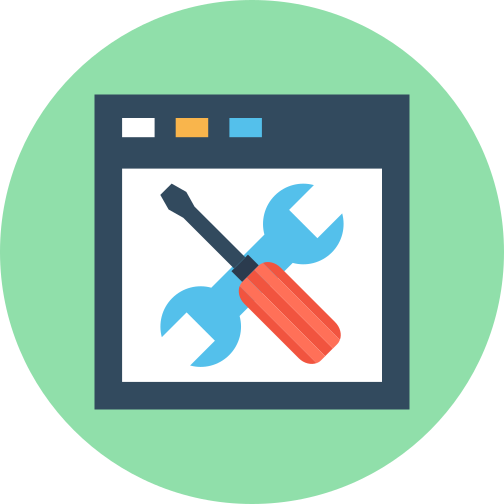

<h1 align="center">
    
</h1>

<h4 align="center">
  Web Development Tools
</h4>

  
  
  
  
  

  <a href="#ferramentas">Ferramentas</a>&nbsp;&nbsp;&nbsp;|&nbsp;&nbsp;&nbsp;
  <a href="#projeto">Projeto</a>&nbsp;&nbsp;&nbsp;|&nbsp;&nbsp;&nbsp;
  <a href="#-como-contribuir">Como contribuir</a>&nbsp;&nbsp;&nbsp;|&nbsp;&nbsp;&nbsp;
  <a href="#memo-licença">Licença</a>

 

## Ferramentas

Ferramentas utilizadas para desenvolvimento de aplicações diversas.

- [x] Trabalhando com versionamento;
  - [x] Git - [Git Download](https://git-scm.com/)
  - [x] Github - [Github Website](https://github.com/)
- [x] Windows;
  - [x] Visual Studio Code - [VSCode Portable](https://portapps.io/app/vscode-portable/)
  - [x] Insomnia - [Insomnia Portable](https://portapps.io/app/insomnia-portable/)
  - [x] Postman - [Postman Portable](https://portapps.io/app/postman-portable/)
  - [x] Discord - [Discord Portable](https://portapps.io/app/discord-portable/)
  - [x] Skype - [Skype Portable](https://portapps.io/app/skype-portable/)
- [x] PHP;
  - [x] PHP - [PHP Download](https://www.php.net/)
  - [x] WAMP - [WampServer Download](https://sourceforge.net/projects/wampserver/)
  - [x] Composer - [Composer Download](https://getcomposer.org/)
  - [x] Packagist - [Packagist](https://packagist.org/)
- [x] Banco de Dados;
  - [x] MySQL - [MySQL Download](https://dev.mysql.com/downloads/installer/)
  - [x] MySQL Workbench - [Workbench Download](https://dev.mysql.com/downloads/workbench/)
  - [x] Postgres - [Postgres Download](https://www.postgresql.org/download/)
  - [x] PostBird - [PostBird Download](https://www.electronjs.org/apps/postbird)
- [x] Fontes TTF;
  - [x] Fira Code - [FiraCode Download](https://github.com/tonsky/FiraCode)
- [x] Extensões do navegador (Chrome);
  - [x] React Developer Tools - Ao inspecionar página mostra os componentes do React;
  - [x] Dracula DevTools Theme - Deixa o inspecionar página (Developer Tools) no tema drácula;

## Projeto

Ao trabalhar em ambiente Windows é possível utilizar aplicativos portáteis, sendo desnecessária instalação dos mesmos, evitando resíduos de instalação e lentidão do sistema operacional.

## Como contribuir

- Faça um fork desse repositório;
- Cria uma branch com a sua feature: `git checkout -b minha-feature`;
- Faça commit das suas alterações: `git commit -m 'feat: Minha nova feature'`;
- Faça push para a sua branch: `git push origin minha-feature`.

Depois que o merge da sua pull request for feito, você pode deletar a sua branch.

## Configuração do VSCode

- [x] Instalar os seguintes plugins;
  - [x] Dracula Theme - Tema escuro para o VSCode;
  - [x] Material Icon Theme - Icones por tipo de arquivo;
  - [x] Rocketseat ReactJS, React Native - Para trabalhar com ReactJS e React Native;
  - [x] Color Highlight - Mostra cor ao digitar código hexadecimal;
  - [x] Live Server - Auto Reload HTML Simples + CSS;
  - [x] Live Share - Mostra cursor de outra pessoa trabalhando em tempo real no projeto;
  - [x] Styled Components - Estilizar componentes no React e ReactNative;
  - [x] GraphQL - snipets e validação dentre outros;
  - [x] GitLens - Funcionalidades do Git Github;
  - [x] ESLint - Padroniza códigos;
  
No VSCode pressionar os atalhos "Ctrl+Shift+P" pesquisar e abrir o arquivo Settings.json (Preferences: Open Setting JSON) e colar o conteúdo abaixo.

`{
    "window.zoomLevel": 0,
    "workbench.startupEditor": "newUntitledFile",
    "workbench.colorTheme": "Dracula",
    "workbench.iconTheme": "material-icon-theme",
    "editor.fontFamily": "Fira Code",
    "editor.fontLigatures": true,
    "editor.fontSize": 14,
    "editor.rulers": [80, 120],
    "editor.renderLineHighlight": "gutter",
    "editor.tabSize": 2,
    "terminal.integrated.fontSize": 14,
    "emmet.includeLanguages": {"javascript": "javascriptreat"},
    "emmet.syntaxProfiles": {"javascript": "jsx"},
    "javascript.updateImportsOnFileMove.enabled": "never",
    "editor.parameterHints.enabled": false,
    "breadcrumbs.enabled": true,
    "javascript.suggest.autoImports": false
}`

## Licença

Esse projeto está sob a licença MIT. Veja o arquivo [LICENSE](LICENSE.md) para mais detalhes.

---

Feito com ♥ by [Jefferson Vidal](https://github.com/jeffersonvidal)
